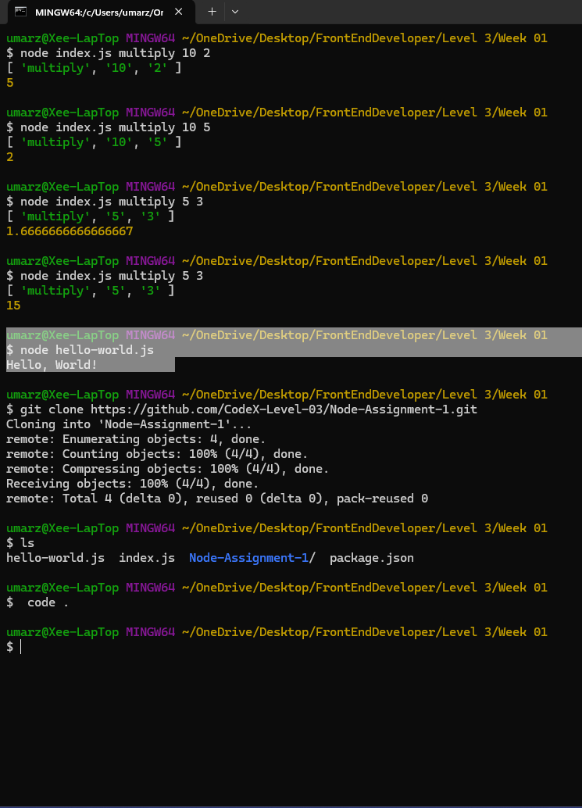

# Node-Assignment-1
Installing and practicing basic node functions 

## Steps to follow:
- Download and Install NodeJs
- Create a folder to work with, on your machine.
- Open git terminal on your machine from within this folder
- Check node version in terminal
- Run npm init -y command to initial node Js
- Open VS code from the terminal
- Create a repository on github and clone it.
- Confirm package.json shown in VScode.
- create hello-world.js file and use it to console.log "HELLO WORLD"
- Capture the results shown in the terminal.

## Confirmation of NodeJs installed and working properly on your machine
### Screenshot

